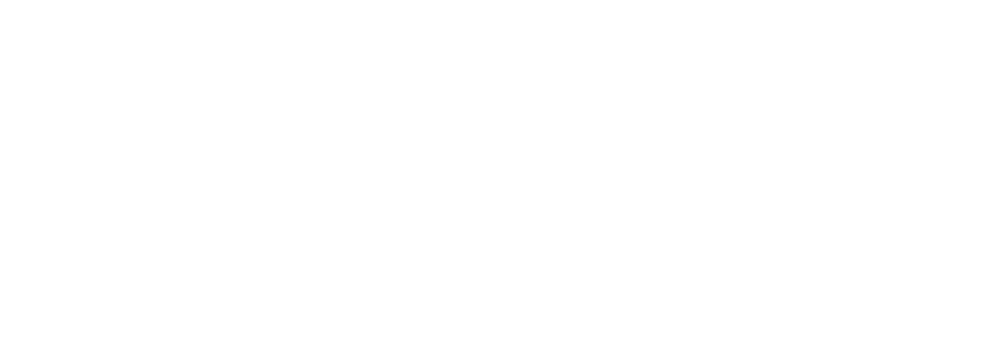

<p align="center">
  
</p>

#

A multi-project repository for creating, maintaining, and compiling visual Echo Fighter registration plugins for Super Smash Bros. Ultimate.

> [!IMPORTANT]
> This repository contains source code, build automation, documentation, and project metadata. It does not redistribute game files or third-party character assets.

## Validated milestone

Dry Bowser is the first hardware-validated project in the collection.

- Independent Character Select Screen entry
- Base fighter: `fighter_kind_koopa`
- UI character: `ui_chara_koopadry`
- Marker: `koopadry.marker`
- Nine styles using `c20-c28`
- Slot-specific models, animations, sounds, UI, and effects
- Stable matches and results screens
- No crashes observed during the initial hardware test

## Repository structure

```text
.github/workflows/       Cloud compilation
template/plugin-source/  Generic validated template
projects/dry-bowser/     First validated project
```

## Build

Use the Actions tab to build either the generic template or the Dry Bowser plugin. Each artifact contains `plugin.nro` and `SHA256SUMS.txt`.

## Creating a project

Copy `template/plugin-source` to `projects/<project-id>/plugin-source`, configure `src/lib.rs`, document the project, compile it, add markers to the local mod package, test on hardware, and preserve a private known-good backup.

## Credits

Based on Ultimate-Auto-Slotting by BigBoss320. Repository integration, Rust compatibility work, GitHub Actions automation, and hardware validation are maintained by PHDev / Pablo Herrera.

This is an unofficial fan-made project and is not affiliated with or endorsed by Nintendo.
